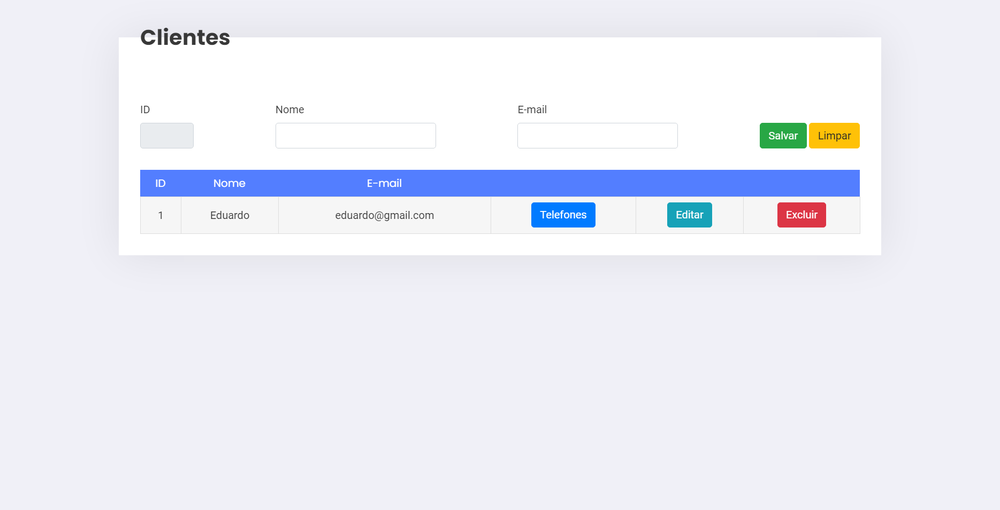
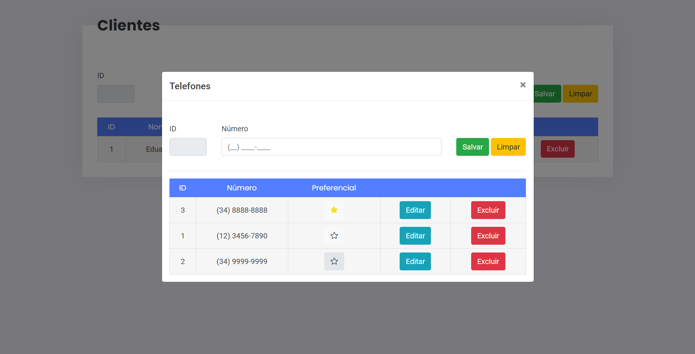

# Telefones - DAW 2

Este é um projeto realizado afim de concluir a primeira atividade da disciplina Desenvolvimento de Aplicações Web 2. 

Instituto Federal de Educação Ciência e Tecnologia do Triângulo Mineiro - Campus Patrocínio.

## Atividade 2

Baseado no projeto iniciado na última aula, são necessárias algumas modificações importantes:

1. Criar no campo para digitar o telefone uma máscara (pode usar o plugin JQuery Mask). Se atentar para que ao salvar o campo no banco de dados, o mesmo seja salvo sem a máscara.

2. Criar um campo chamado Telefone Preferencial (Tipo Checkbox). Esse campo deve ser marcado como 0/1, true/false, sim/não no banco, para informar se esse é um telefone preferencial para entrar em contato com o cliente. Na listagem, quando o telefone for preferencial, exibir o mesmo com algum destaque (sublinhado, algum ícone, etc), e sempre exibir os telefones preferenciais no início da listagem. Não há problema em existir mais de um telefone preferencial para cada Cliente.

# Preparando o ambiente

Para iniciar o projeto é necessário ter instalado em sua máquina o [NodeJS](https://nodejs.org/pt-br/) e a CLI do [AdonisJS](https://legacy.adonisjs.com).

```bash
$ npm i -g @adonisjs/cli
```

## Dependências
Após a instalação do NodeJS e a CLI do AdonisJS, é necessário instalar as dependências e criar o banco de dados.

- Usando **npm**

```bash
$ npm install
$ adonis migration:run
```

- Usando **yarn**

```bash
$ yarn install
$ adonis migration:run
```

## Iniciando o servidor


```bash
$ adonis serve --dev
```

O servidor será iniciado http://localhost:3333/ e a porta poderá ser alterada no arquivo .env

# Prints do Projeto

